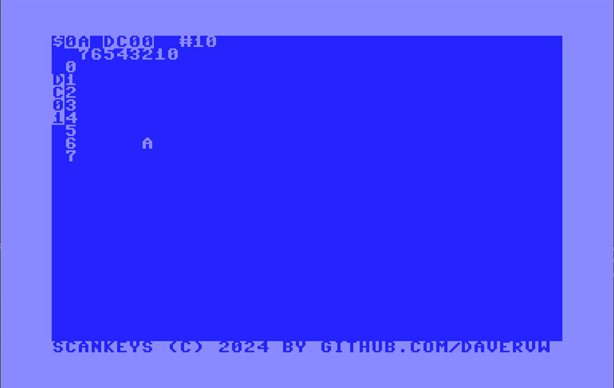

# scankeys - demo Commodore 64 keyboard matrix #

Actively scan Commodore 64 keyboard matrix and display pressed keys on screen

Usage:

````
LOAD "SCANKEYS",8,1
SYS 49152
````

STOP+RESTORE may get you to a BASIC prompt if you are lucky, keep trying (hold STOP, tap RESTORE repeatedly).  Otherwise reset system.


